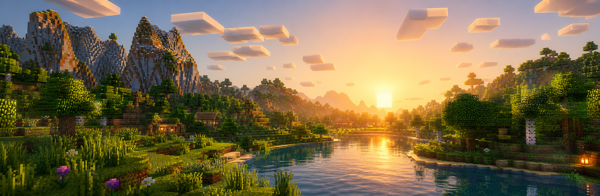
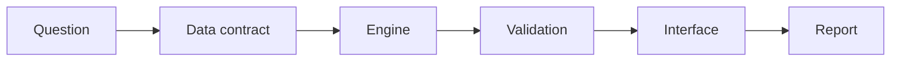

  

# Mr.H.Zhou / Elvin-Chow

Full-stack developer building data systems for finance, research workflows, and calm product interfaces.

`frontend + backend` / `data analysis` / `financial analysis` / `risk systems`

[DeepFirm Quant](https://github.com/Elvin-Chow/DeepFirm-Quant) · [FundX Workspace](https://github.com/Elvin-Chow/FundX) · [Paper Artifacts](https://github.com/Elvin-Chow/DeepFirm-Quant_Paper-Artifact-Repository)

---

### Player Card

I like Minecraft shader worlds for the same reason I like good product systems: clear terrain, readable paths, soft contrast, and enough atmosphere to make the hard parts feel approachable.

My work usually starts with a messy research or portfolio question and ends as something inspectable: a data contract, a calculation engine, validation checks, an interface, and a report.

### Active Quests

| Quest | Build | Links |
| --- | --- | --- |
| **DeepFirm Quant** | ML risk-control, alpha attribution, tail-risk views, and Bayesian portfolio decisions. | [Repo](https://github.com/Elvin-Chow/DeepFirm-Quant) / [Live](https://deep-firm-quant.vercel.app) |
| **FundX Workspace** | US-market portfolio workspace for discovery, planning, watchlists, and reports. | [Repo](https://github.com/Elvin-Chow/FundX) / [Live](https://fundx-opal.vercel.app) |
| **Paper Experiments** | Reproducibility lab for configs, figures, tables, warnings, and rerunnable checks. | [Repo](https://github.com/Elvin-Chow/DeepFirm-Quant_Paper-Artifact-Repository) |

### Crafting Table

| Layer | Kit |
| --- | --- |
| Product UI | React, TypeScript, Vite |
| Backend | Python, FastAPI, SQL |
| Analysis | pandas, modeling pipelines, report automation |
| Delivery | GitHub, Vercel, docs, reproducible artifacts |

### Main Route

### Operating Style

- Build practical research tools, not one-off notebooks.
- Keep assumptions visible near the output.
- Make dense data calm enough to scan, compare, and return to later.

### Live Signals

These project signals are refreshed from the GitHub API by a scheduled workflow.

<!-- PROFILE-METRICS:START -->
| Project | Language | Stars | Forks | Open items | Last push |
| --- | --- | ---: | ---: | ---: | --- |
| [DeepFirm-Quant](https://github.com/Elvin-Chow/DeepFirm-Quant) | Python | 3 | 1 | 2 | 2026-06-12 |
| [FundX](https://github.com/Elvin-Chow/FundX) | TypeScript | 1 | 0 | 0 | 2026-06-26 |
| [DeepFirm-Quant_Paper-Artifact-Repository](https://github.com/Elvin-Chow/DeepFirm-Quant_Paper-Artifact-Repository) | Python | 0 | 0 | 0 | 2026-05-18 |
<!-- PROFILE-METRICS:END -->

  
  

  

