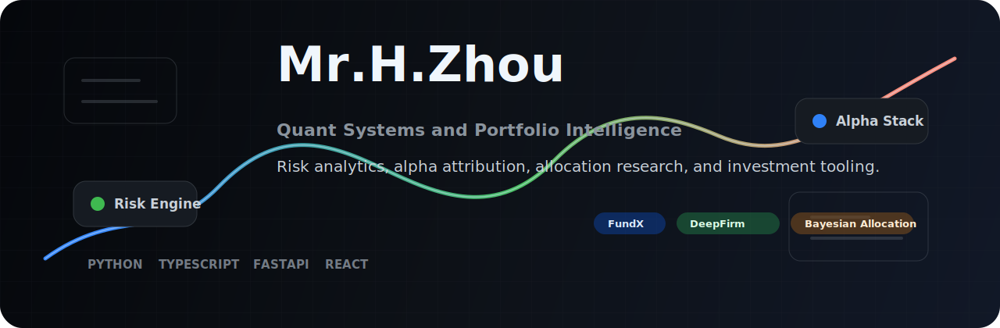

<p align="center">
  
</p>

<p align="center">
  <a href="https://github.com/Elvin-Chow?tab=repositories">
    
  </a>
  <a href="https://github.com/Elvin-Chow/DeepFirm-Quant">
    
  </a>
  <a href="https://github.com/Elvin-Chow/FundX">
    
  </a>
</p>

<h1 align="center">Hi, I am H. Zhou</h1>

<p align="center">
  Quant finance builder focused on portfolio systems, risk analytics, and research tools that turn market data into usable decisions.
</p>

<p align="center">
  
</p>

---

## Current Focus

I build tools where financial research, product design, and engineering meet.

| Area | What I care about |
| --- | --- |
| Portfolio systems | Asset discovery, allocation workflows, DCA planning, and reporting |
| Quant research | Risk analysis, alpha attribution, Bayesian portfolio optimization |
| Product engineering | Fast, readable interfaces for repeated research and investment work |
| Data workflow | Local-first datasets, reproducible calculations, and transparent assumptions |

## Featured Work

| Project | Stack | Snapshot |
| --- | --- | --- |
| [DeepFirm-Quant](https://github.com/Elvin-Chow/DeepFirm-Quant) | Python | Industrial-grade quant risk analysis, alpha attribution, and Bayesian portfolio optimization |
| [FundX](https://github.com/Elvin-Chow/FundX) | TypeScript, React, FastAPI | US-market portfolio management workspace for discovery, construction, comparison, watchlists, DCA plans, and reports |
| [DeepFirm Quant Paper Artifact](https://github.com/Elvin-Chow/DeepFirm_Quant_Paper-Artifact-Repository) | Python | Research artifact repository for experiments, reproducibility, and paper materials |

## Tooling

<p align="center">
  
</p>

<p align="center">
  
  
</p>

## Working Style

```text
Research question -> data contract -> calculation engine -> interface -> report
```

- I prefer practical research tools over one-off notebooks.
- I like systems that make assumptions visible and results reproducible.
- I care about interfaces that stay calm when the underlying math gets complex.
- I am currently shaping FundX into a full investment research and portfolio workspace.

## Contribution Map

<p align="center">
  <picture>
    <source media="(prefers-color-scheme: dark)" srcset="https://raw.githubusercontent.com/Elvin-Chow/Elvin-Chow/output/github-contribution-grid-snake-dark.svg" />
    <source media="(prefers-color-scheme: light)" srcset="https://raw.githubusercontent.com/Elvin-Chow/Elvin-Chow/output/github-contribution-grid-snake.svg" />
    
  </picture>
</p>

## Contact

<p align="center">
  <a href="https://github.com/Elvin-Chow">
    
  </a>
</p>
