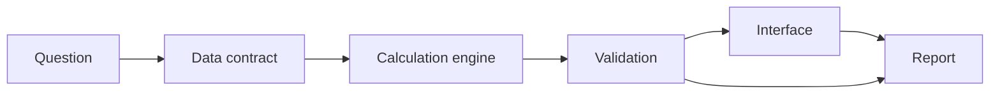

  

  <b>Full-stack data systems with a Minecraft shader mood: clear terrain, visible paths, calm light.</b> 
  I turn messy finance and research workflows into data contracts, risk engines, and usable product surfaces.

  
  
  

  <a href="https://github.com/Elvin-Chow/DeepFirm-Quant">DeepFirm Quant</a>
  &nbsp;&nbsp;/&nbsp;&nbsp;
  <a href="https://github.com/Elvin-Chow/FundX">FundX Workspace</a>
  &nbsp;&nbsp;/&nbsp;&nbsp;
  <a href="https://github.com/Elvin-Chow/DeepFirm-Quant_Paper-Artifact-Repository">Paper Artifacts</a>

 

## Spawn Point

| Build identity | Current coordinates |
| --- | --- |
| **Role** | Full-stack developer working across product UI, backend services, data analysis, and financial analysis. |
| **Taste** | Game-like clarity without noisy decoration: readable panels, calm contrast, and obvious paths through complex systems. |
| **Loop** | `question -> data contract -> calculation engine -> validation -> interface -> report` |
| **Goal** | Make research and portfolio work inspectable, repeatable, and useful enough to return to later. |

## Quest Log

| Quest | Current build | Output | Portal |
| --- | --- | --- | --- |
| **DeepFirm Quant** | Industrial-grade quant risk analysis, alpha attribution, and Bayesian portfolio optimization. | Risk dashboards, validation flows, allocation research. | [Repo](https://github.com/Elvin-Chow/DeepFirm-Quant) / [Live](https://deep-firm-quant.vercel.app) |
| **FundX Workspace** | US-market portfolio workspace for discovery, planning, watchlists, and reports. | Full-stack app with portfolio records and fund modeling. | [Repo](https://github.com/Elvin-Chow/FundX) / [Live](https://fundx-opal.vercel.app) |
| **Paper Experiments** | Reproducibility lab for experiment material, configs, tables, figures, and guardrails. | Clean artifacts that can be checked and rerun. | [Repo](https://github.com/Elvin-Chow/DeepFirm-Quant_Paper-Artifact-Repository) |

## Crafting Stack

| Layer | Tools | What I use it for |
| --- | --- | --- |
| **Product UI** | React, TypeScript, Vite | Interfaces that make dense data easier to scan, compare, and revisit. |
| **Backend** | Python, FastAPI, SQL | APIs, service boundaries, data contracts, and calculation engines. |
| **Analysis** | pandas, modeling pipelines, reports | Risk, factors, attribution, validation, and reproducible evidence. |
| **Delivery** | GitHub, Vercel, docs | Small deployable systems with visible assumptions and clean handoff notes. |

## Main Questline

## Working Mode

| Bias | How it shows up |
| --- | --- |
| **Practical systems over one-off notebooks** | Research becomes a product surface, not just a result. |
| **Visible assumptions over black boxes** | Inputs, checks, and failure modes stay close to the output. |
| **Calm interfaces over loud dashboards** | The UI should help people decide, compare, and come back later. |

## Live Project Signals

This section is refreshed from the GitHub API by a scheduled workflow, so the numbers below stay real instead of decorative.

<!-- PROFILE-METRICS:START -->
| Project | Language | Stars | Forks | Open items | Last push |
| --- | --- | ---: | ---: | ---: | --- |
| [DeepFirm-Quant](https://github.com/Elvin-Chow/DeepFirm-Quant) | Python | 3 | 1 | 2 | 2026-06-12 |
| [FundX](https://github.com/Elvin-Chow/FundX) | TypeScript | 1 | 0 | 0 | 2026-06-26 |
| [DeepFirm-Quant_Paper-Artifact-Repository](https://github.com/Elvin-Chow/DeepFirm-Quant_Paper-Artifact-Repository) | Python | 0 | 0 | 0 | 2026-05-18 |
<!-- PROFILE-METRICS:END -->

## GitHub Pulse

  
  

  

