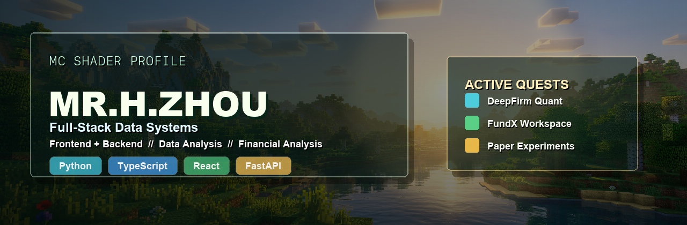
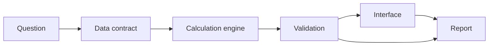

  

<h1 align="center">Mr.H.Zhou / Elvin-Chow</h1>

  Full-stack data systems for finance, research workflows, and calm product interfaces.

  
  
  

  <a href="https://github.com/Elvin-Chow/DeepFirm-Quant">DeepFirm Quant</a>
  |
  <a href="https://github.com/Elvin-Chow/FundX">FundX</a>
  |
  <a href="https://github.com/Elvin-Chow/DeepFirm-Quant_Paper-Artifact-Repository">Paper Artifacts</a>

---

### Focus

I build practical product systems where data, finance, and interface design meet. My favorite work starts as messy research and ends as something inspectable, repeatable, and useful.

`travel lens -> product context -> data contract -> risk model -> usable interface`

### Active Quests

| Track | What it is | Output | Links |
| --- | --- | --- | --- |
| DeepFirm Quant | Industrial-grade quant risk analysis, alpha attribution, and Bayesian portfolio optimization. | Risk dashboards, validation flows, allocation research. | [Repo](https://github.com/Elvin-Chow/DeepFirm-Quant) / [Live](https://deep-firm-quant.vercel.app) |
| FundX | US-market portfolio workspace for discovery, planning, watchlists, and reports. | Full-stack app with portfolio records and fund modeling. | [Repo](https://github.com/Elvin-Chow/FundX) / [Live](https://fundx-opal.vercel.app) |
| Paper Artifacts | Reproducibility lab for experiment material, configs, tables, figures, and guardrails. | Clean artifacts that can be checked and rerun. | [Repo](https://github.com/Elvin-Chow/DeepFirm-Quant_Paper-Artifact-Repository) |

### Build Map

### Stack

| Layer | Tools I reach for | What I use it for |
| --- | --- | --- |
| Product UI | React, TypeScript, Vite | Interfaces that make complex data feel composed. |
| Backend | Python, FastAPI, SQL | APIs, services, data contracts, and calculation engines. |
| Analysis | pandas, modeling pipelines, reports | Risk, factors, attribution, reproducible evidence. |
| Delivery | GitHub, Vercel, docs | Small deployable systems with visible assumptions. |

<b>Working Mode</b>

| Bias | How it shows up |
| --- | --- |
| Practical systems over one-off notebooks | Research becomes a product surface, not just a result. |
| Visible assumptions over black boxes | Inputs, checks, and failure modes stay close to the output. |
| Calm interfaces over loud dashboards | The UI should help people compare, decide, and return later. |

### Live Project Signals

This section is real Markdown, not a static image. A scheduled GitHub Action refreshes it from the GitHub API.

<!-- PROFILE-METRICS:START -->
| Project | Language | Stars | Forks | Open items | Last push |
| --- | --- | ---: | ---: | ---: | --- |
| [DeepFirm-Quant](https://github.com/Elvin-Chow/DeepFirm-Quant) | Python | 3 | 1 | 2 | 2026-06-12 |
| [FundX](https://github.com/Elvin-Chow/FundX) | TypeScript | 1 | 0 | 0 | 2026-06-19 |
| [DeepFirm-Quant_Paper-Artifact-Repository](https://github.com/Elvin-Chow/DeepFirm-Quant_Paper-Artifact-Repository) | Python | 0 | 0 | 0 | 2026-05-18 |
<!-- PROFILE-METRICS:END -->

### GitHub Pulse

  
  

  

